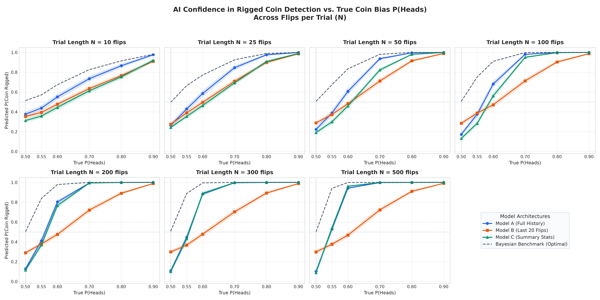
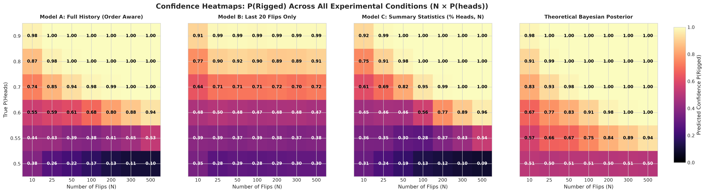

# How Confident Is AI That A Coin Is Rigged? 
I designed an experiment to test how confident AI algorithms are that a coin is rigged. One algorithm had the entire history of flips, one had only the most recent 20 flips, and one had only the summary statistics (% heads, number of flips). To create many different scenarios, I varied the probability of the coin landing on heads from 0.5 to 0.9, and conducted trials from 10 flips to 500 flips. I also added a Bayesian baseline that uses statistical probability to compute a heuristic guess.

In addition to running the initial experiment, the user has the option to run a "coaxing experiment" to test how much they can swindle the AI algorithms with a rigged coin. The goal is to maximize profit over 100 rounds, over which the algorithms must be less than 90% confident that the coin is rigged. 

[Blog link coming soon]

## Motivation
We often hear that life is unfair, but one of the fairest ways people can think to decide trivial things is to flip a coin. Yet, we often take for granted that coins are fair. What if, much like reality, a given coin isn't fair? How would we know? How sure could we be that is isn't some statistical fluke? To answer these questions, I turned to AI. I wanted to see how much evidence the different proposed algorithms needed to be reasonably confident that the coin was in fact rigged. 

## Overview
I used Google Antigravity to generate the following code base for the initial investigation:

**models.py:** Stores the three models used in the investigation. The output of the model is the confidence level that the true P(heads) > 0.5, not the predicted P(heads).

**train.py:** Trains the models using a Brier score loss function instead of simple accuracy (predicted P(heads) v.s. actual).

**evaluate.py:** Loads the trained models and conducts the investigation.

**visualize.py:** Generates the figures to help the user interpret the data. The visuals include reported loss, confidence v.s. true "rigged" parameter, confidence v.s. sample size, a heatmap visual to combine both, and the information lost due to Model B's limited memory.  

**run_experiment.py:** The driver code for the entire investigation.

**coax_experiment.py:** The coaxing game where the user tries to swindle the AI algorithms. 

Additionally, the user can view an automated report on the latest experiment they run in **dashboard.html**, generated by **generate_report.py**. Furthermore, the unittests generated by Gemini are in **test_sanity.py**.

## Results
For all models and the Bayesian benchmark, confidence that the coin is rigged gradually grew to 100% as the level of riggedness increased. All measurements also reached full confidence sooner as the sample size increased. With fair coins, the exact opposite trend occurred (rapidly reached conclusion that the coin was fair). 
 

Here is a heatmap that provides a more intuitive representation of the data:
 

In the coaxing game, all models realized that the coin was rigged within 6 rounds of just playing heads (the first to notice were the Bayesian baseline and Model C after 3 heads), but more stealthy methods of swindling lasted the full 100 rounds, resulting in win rates from 55-72%. 

## Approach

### 1. Experimental Setup
This investigation measured the effect of changing the base model (AI algorithms with different inputs plus a Bayesian baseline), number of total coin flips, and riggedness of the coin on the confidence that the coin was rigged. Thus, the investigation is actually three separate experiments, gauging the effect of each independent variable on the dependent variable while holding the others constant. Confidence guesses were evaluated using the Brier score loss function, which is a more insightful gauge than pure accuracy. Accuracy only looks at the true P(heads), but that doesn't actually measure confidence in a prediction. If the model outputs a confidence of 62% that the coin is rigged, we should see a significantly more number of heads than tails in 62% of the trials if the Brier score is minimized.  

### 2. Model Architecture
Model A is a 1D CNN that is able to look at the sequence of coin flips, extracting any useful information from the order of results, not just the summary statistics. 

Model B is the same model, but with a fixed context window of 20 flips (the most recent flips). 

Model C is a 3-layer dense MLP with only takes in the summary statistics. 

### 3. Training & Evaluation
The training dataset included 5.08 million individual coin flips, seen across 12 epochs. The labels (true P(heads)) were evenly split between fair and unfair, and the unfair degree was uniformly distributed from 0.51 to 0.95 (put into buckets shown above). All models were evaluated with 500 independent Monte Carlo trials per configuration, totaling 21,000 (500*42).   

## Installation & Usage
### 1. Repeat The Initial Experiment
Run the driver code (a pipeline of the files mentioned above):

```bash
python run_experiment.py
```
*Outputs saved*: Model checkpoints, figures, and 'dashboard.html'.

---

### 2. Repeat The "Coaxing" Experiment
Play the interactive game:

```bash
python coax_experiment.py
```
---

Test other algoritms:

```bash
python coax_experiment.py --benchmark  # includes an adaptive coaxer which tests different thresholds of risk-taking
python coax_experiment.py --sequence "HTTHHHTTH"  # custom sequence
python coax_experiment.py --auto  # no risk-taking threshold, AI algorithm but not ML (looks ahead 1 flip, heuristic evaluater)
```
---
